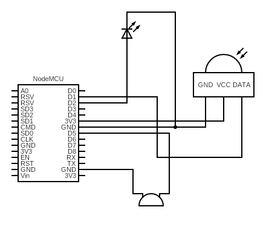
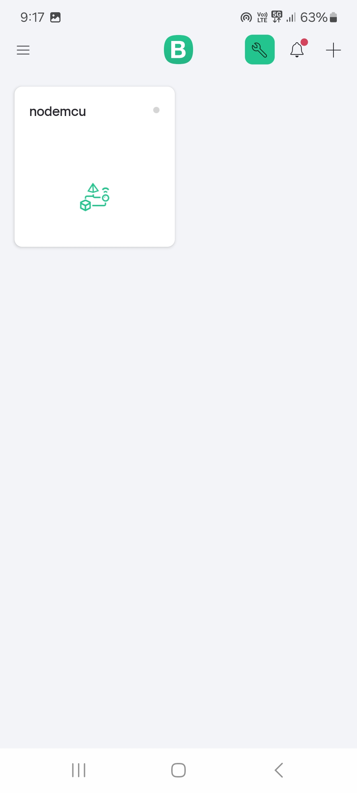
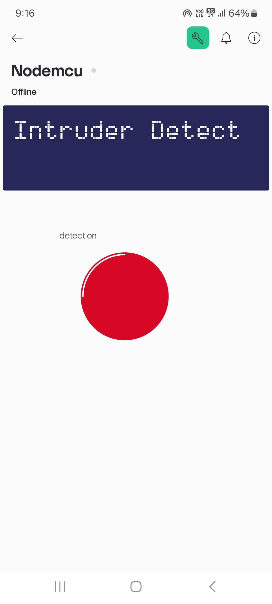
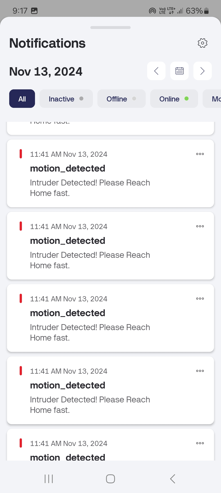

# Home Intrusion Detection System with Blynk Integration 🚨  

**“Because nothing says ‘Welcome Home’ like a buzzing alarm when you forget you’re the intruder!”**  

This project demonstrates a smart, IoT-based home intrusion detection system using NodeMCU, PIR motion sensor, buzzer, LED, and the Blynk app. Whether it’s a sneaky sibling, your pet’s curious escapades, or an actual intruder, this system ensures you’re in the loop — complete with flashy lights, loud alarms, and real-time notifications. Who needs ADT when you have a NodeMCU? 😉

---

## Features 🌟  
- **Motion Detection**: The PIR sensor does the heavy lifting of spotting movements.  
- **Audible and Visual Alerts**: Immediate feedback via a buzzer and LED.  
- **Real-Time Notifications**: The Blynk app keeps you updated faster than your group chat.  
- **Remote Monitoring**: You can always stay connected to your system, even if you're *totally* ignoring your responsibilities.  

---

## Components Used 🛠️  
1. **NodeMCU (ESP8266)**  
   The Wi-Fi-enabled microcontroller that bridges the sensors and the cloud. Think of it as the manager that makes everyone do their job while taking credit.  

2. **PIR Motion Sensor**  
   Detects motion using infrared radiation changes. It’s like the intern who can only say “movement” or “no movement” but is essential to the team.  

3. **Buzzer**  
   Produces an audible alarm when motion is detected. It’s not subtle, but hey, neither are burglars.  

4. **LED**  
   Lights up to indicate motion detection. Because a dramatic flair never hurt anyone.  

5. **Blynk App**  
   Enables remote notifications and real-time monitoring. The app where you finally feel like a hacker in a movie, even if it’s just for your living room.

---

## Circuit Diagram 🖼️  

  

Here’s how to connect everything:  
- **PIR sensor** to NodeMCU (VCC, GND, D1).  
- **LED** to NodeMCU (D2).  
- **Buzzer** to NodeMCU (D5).  

---

## Setting Up the Blynk App 📲  

### Step 1: Create a New Project  
1. Download and install the **Blynk IoT app** from the Play Store or App Store.  
2. Log in or sign up for a free account.  
3. Click **“+ New Template”**:  
   - **Template Name**: `NodeMCU Project`  
   - **Hardware**: `ESP8266`  
   - **Connection Type**: `Wi-Fi`  

4. Copy the **Template ID**, **Template Name**, and **Auth Token** (guard this like your Netflix password). These will be used in your Arduino code.

---

### Step 2: Add Widgets to Your Project  
1. Open the **Blynk app** and create a new project.  
2. Add widgets like:  
   - Notification widget (to let you know when things go bump in the night).  
   - LED widget linked to Virtual Pin `V1`.  

---

### Blynk App Screenshots 📱  

Want to see what it looks like? Check out these screenshots from the Blynk app:  

|  |  |  |  
|:---------------------------------------:|:---------------------------------------:|:---------------------------------------:|  

---

## Code Overview 💻  

Here’s the Arduino code to make everything work. Don’t forget to replace the placeholders with your **Wi-Fi credentials** and **Auth Token**. Pro tip: Triple-check your Wi-Fi password unless you enjoy debugging connectivity issues.  

```cpp
#define BLYNK_TEMPLATE_ID "Your_Template_ID"
#define BLYNK_TEMPLATE_NAME "Your_Template_Name"
#define BLYNK_AUTH_TOKEN "Your_Auth_Token"

#include <ESP8266WiFi.h>
#include <BlynkSimpleEsp8266.h>

#define PIR_PIN D1           // PIR sensor OUT pin connected to D1
#define LED_PIN D2           // LED connected to D2 for feedback
#define BUZZER_PIN D5        // Buzzer connected to D5

char ssid[] = "Your_WiFi_SSID";        // Replace with your Wi-Fi SSID
char pass[] = "Your_WiFi_PASSWORD";    // Replace with your Wi-Fi Password

void setup() {
  Serial.begin(9600);
  pinMode(PIR_PIN, INPUT);
  pinMode(LED_PIN, OUTPUT);
  pinMode(BUZZER_PIN, OUTPUT);

  Blynk.begin(BLYNK_AUTH_TOKEN, ssid, pass);   // Initialize Blynk connection
}

void loop() {
  Blynk.run();                     
  int pirState = digitalRead(PIR_PIN);  

  if (pirState == HIGH) {   
    Serial.println("Motion Detected!");
    digitalWrite(LED_PIN, HIGH);       
    tone(BUZZER_PIN, 1000);           
    Blynk.logEvent("motion_detected", "Motion Detected!");
    Blynk.virtualWrite(V1, 255);       
  } else {
    Serial.println("No Motion");
    digitalWrite(LED_PIN, LOW);        
    noTone(BUZZER_PIN);                
    Blynk.virtualWrite(V1, 0);         
  }
  
  delay(500);  
}
```

## Contributors 🎉

- Priyanshu Gupta
- Ravi Tiwari
- Raju Kumar
- Sumit Kumar

